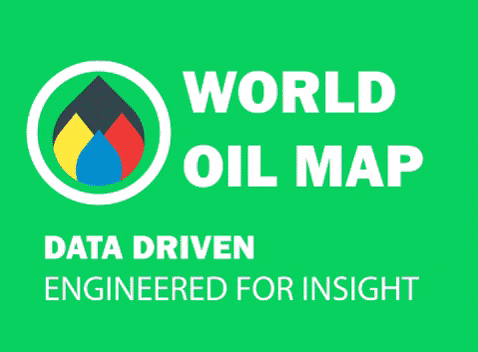

# OilMap-Web 🗺🛢 🌟
Visualizing oil data on country maps using OilMap
---

### OilMap is an independent initiative to monitor the Oil & Gas industry of world promoting transparency and accountability in decision making and investment.
---

[live demo](http://oilmap.xyz)

---
## License
This project is licensed under the MIT License - see the [LICENSE.md](LICENSE.md) file for details

---
## Authors
* **Roque Leal** - *Initial work* - [Roque](https://www.roqueleal.me/)
---
## Community
- [Tiwtter](https://twitter.com/oilmapxyz)
- [Medium](https://medium.com/@roqueleal/world-oil-map-e46b774ea82b)
---

## Certifications
* **ODI** - *Open Data Certificate * - [ODI](https://certificates.theodi.org/en/datasets/220195/certificate)

---
## Acknowledgments
* **MapBox** - *Maps* - [MapBox](https://www.mapbox.com/)
* **Inspiration** - *Amnesty Oil Spills* - [MapBox Labs](https://labs.mapbox.com/amnesty/)
